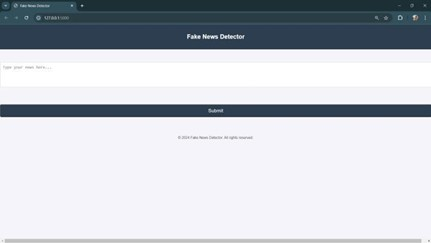
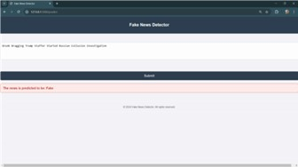

# Fake News Detection System


---

A machine learning–based fake news detection web application built with **Python**, **Flask**, **TF-IDF vectorization**, and a **Random Forest classifier** to classify news articles as **Fake** or **Real**.

## Overview

This project was developed to address the growing problem of misinformation by building a practical and user-friendly fake news detection system. The application combines natural language preprocessing, feature extraction, and machine learning to analyze article text and return a prediction through a simple web interface.

The deployed model uses a **Random Forest classifier** trained on processed news text, while the frontend allows users to paste an article and receive a result in real time.

## Preview

<table align="center">
  <tr>
    <td align="center">
      <br>
      <sub><b>Fake News Detector Interface </b></sub>
    </td>
    <td width="30"></td>
    <td align="center">
      <br>
      <sub><b>Prediction Result Example</b></sub>
    </td>
  </tr>
</table>

## Key Features

- Classifies news articles as **Fake** or **Real**
- Uses **NLP preprocessing** to clean and normalize text
- Uses **TF-IDF vectorization** to convert text into numerical features
- Uses a **Random Forest classifier** for prediction
- Includes a **Flask-based web interface** for real-time user interaction
- Stores trained model artifacts using **Joblib**
- Explores and compares multiple machine learning models

## Tech Stack

### Language


### Backend / Web Framework


### Machine Learning / NLP


### Data / Utilities


### Frontend


## How It Works

1. The user enters or pastes the text of a news article into the web interface.
2. The backend preprocesses the text by cleaning, normalizing, and lemmatizing it.
3. The processed text is transformed into numerical features using **TF-IDF vectorization**.
4. The trained **Random Forest model** predicts whether the article is **Fake** or **Real**.
5. The result is returned and displayed on the web page in real time.

## NLP / ML Pipeline

```text
User Input
   ↓
Text Cleaning
   ↓
Tokenization
   ↓
Stopword Removal
   ↓
Lemmatization
   ↓
TF-IDF Vectorization
   ↓
Random Forest Classification
   ↓
Prediction Output (Fake / Real)
```

## Results Summary

Multiple machine learning models were explored and compared for fake news classification. Among the evaluated models, the **Random Forest classifier** provided the best overall balance of performance, robustness, and interpretability, making it the final choice for deployment in the web application.

## Models Evaluated

This project explored multiple models for fake news classification, including:

- Logistic Regression
- Naive Bayes
- Random Forest
- Gradient Boosting (XGBoost)
- LSTM

The final system uses **Random Forest** because it performed best overall for this project.

## Why Random Forest

Random Forest was selected as the final model because it offered:

- Strong classification performance
- Better handling of feature-rich text data
- Good robustness against overfitting
- Useful interpretability through feature importance
- Practical efficiency for real-time web-based prediction

## Project Structure

```text
Fake-News-Detection/
├── static/
│   └── styles.css
├── templates/
│   └── index.html
├── app.py
├── random_forest_model.joblib
└── tfidf_vectorizer.joblib
```

## File Details

- `app.py` — main Flask application file
- `random_forest_model.joblib` — saved trained Random Forest model
- `tfidf_vectorizer.joblib` — saved TF-IDF vectorizer
- `templates/index.html` — frontend page for article input and prediction result
- `static/styles.css` — styling for the web interface

## How to Run

### Requirements

- Python 3.x
- Flask
- scikit-learn
- joblib
- pandas
- numpy

### Install Dependencies

```bash
pip install flask scikit-learn joblib pandas numpy
```

### Run the Application

```bash
python app.py
```

Then open the local Flask URL shown in the terminal, usually:

```bash
http://127.0.0.1:5000
```

## Future Improvements

- Add multilingual fake news detection
- Integrate real-time APIs for live news monitoring
- Add a user feedback loop for continuous improvement
- Improve contextual understanding of articles
- Expand the dataset with more diverse domains
- Deploy the application as a scalable cloud-based service

## Notes

- This project combines traditional machine learning with NLP techniques for practical fake news detection.
- The repository includes saved model artifacts for inference through the Flask web interface.
- The application is designed to be lightweight, accessible, and easy to run locally.

## Author

**Hasibur Rahman**
